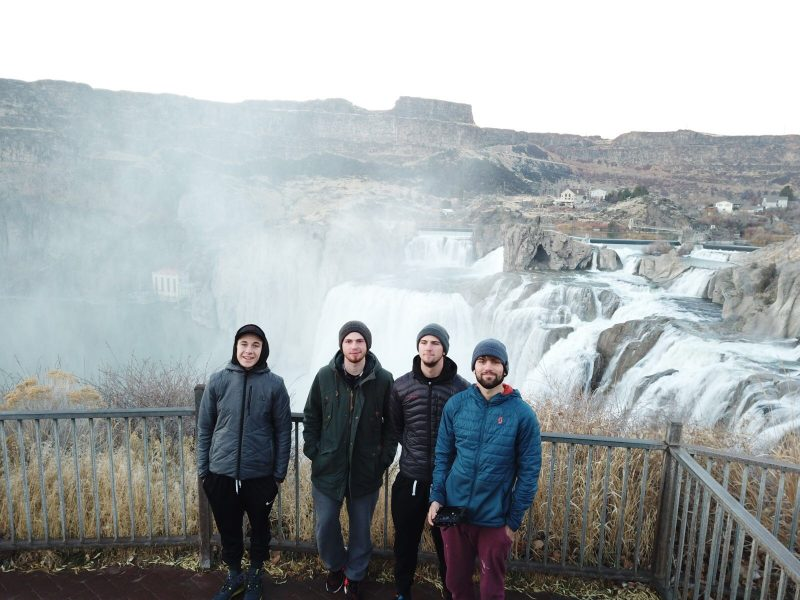

Hello there!

We are Gringostogo, three dudes from Switzerland, who travel from Aptos (California, USA) to Calgary (Alberta, Canada) and after this all the way down to Ushuaia (Argentina).
On our to do list are National Parks, Cities, stunning landscapes, awesome people and wonderful memories.
Let us start with the real beginning. Two years ago, Jonas had just a idea of traveling through north-and south america. But sometimes it is a little bit boring to travel on yourself, so he decided to ask his friends Manuel and Joël if they wanna join him. First they thought Jonas is a little bit crazy. Who can travel through this two continents at the age of just 20 years…where’s the money man?!
But after one year of work, they saw it’s possible to do this at the age of 20, if they safe enough money while their apprenticeship and military service.
After this decision we planned a little bit and a few months later we already went to Aptos and moved in to Brownie our 84 VW Vanagon.

So that’s our story, we all hope you like us and follow our travels.

Stay tuned

los Gringos..
